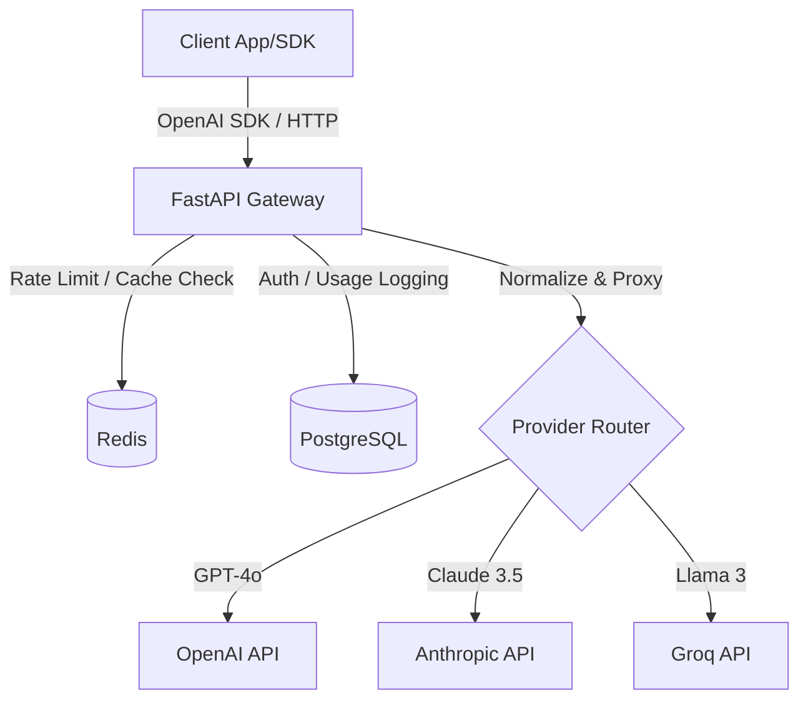

# LLM Inference Gateway

A production-shaped, OpenAI-compatible HTTP gateway built in Python. Designed to proxy requests to OpenAI, Anthropic, and Groq with unified routing, caching, rate limiting, and observability. 

Built with **FastAPI**, **Redis**, and **PostgreSQL**.

---

## What This Is

This project is a high-performance LLM proxy gateway. Instead of applications talking directly to OpenAI or Anthropic, they point to this gateway. It normalizes all requests and responses to the OpenAI schema, allowing seamless swapping of models (e.g., from `gpt-4o` to `claude-3-5-sonnet`) without changing client code.

**Key Features (WIP - Days 1 to 3):**
- **Unified API:** Drop-in replacement for the OpenAI base URL.
- **Provider Routing:** Automatically routes to OpenAI, Anthropic, or Groq based on the model prefix.
- **Normalized Streaming:** Native SSE (Server-Sent Events) streaming translation with zero perceived latency.
- **Token Bucket Rate Limiting:** Redis-backed, per-API-key RPM/TPM limits.
- **Semantic/Exact Caching:** Redis caching to reduce provider costs.
- **Observability:** Postgres request logging (latency, token counts, cost).

## Architecture



## Design Decisions

1. **Pydantic v2 as the Source of Truth:** All incoming requests are strictly validated into an OpenAI-compatible Pydantic schema before any routing occurs.
2. **`httpx` Connection Pooling:** A single, shared async HTTP client is initialized during FastAPI's `lifespan` to prevent socket exhaustion under high concurrency.
3. **`StreamingResponse` for SSE:** We do not buffer tokens in memory. As chunks arrive from downstream providers, they are immediately yielded to the client to keep Time-to-First-Token (TTFT) as low as possible.
4. **Abstract Base Provider:** Polymorphic `complete()` and `stream()` methods ensure the core router remains completely decoupled from provider-specific logic.

## Quick Start

### 1. Setup Environment
```bash
python3 -m venv .venv
source .venv/bin/activate
pip install -r requirements.txt
```

### 2. Run the Gateway
Provide your API keys as environment variables:
```bash
OPENAI_API_KEY="sk-..." uvicorn app.main:app --reload
```

### 3. Hero Curl (Streaming)
The gateway exposes a drop-in `/v1/chat/completions` endpoint:
```bash
curl -X POST http://localhost:8000/v1/chat/completions \
  -H "Content-Type: application/json" \
  -d '{
    "model": "gpt-4o-mini",
    "messages": [{"role": "user", "content": "Explain async in Python in 1 sentence."}],
    "stream": true
  }'
```

## Benchmarks
*(In Progress)*

## ☁️ Deployment
*(In Progress)*

## 🧠 What I Learned
*(To be populated at the end of the project)*
