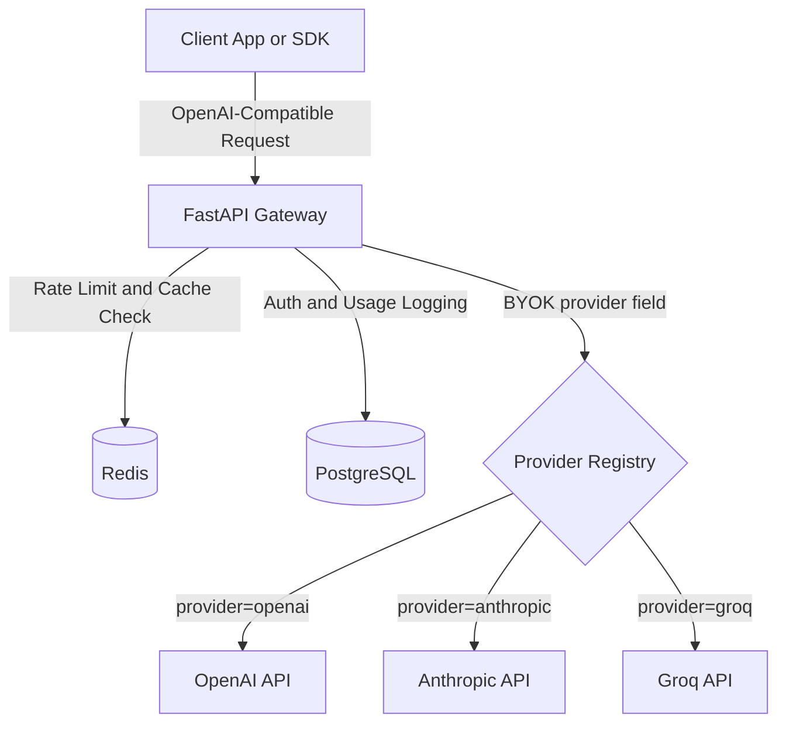

# LLM Inference Gateway

OpenAI-compatible LLM gateway with multi-provider routing, streaming normalization, Redis-backed rate limiting, fallback handling, caching, and usage analytics.

Built with **FastAPI**, **Redis**, and **PostgreSQL**.

## Demo
- Live: https://llm-inference-gateway.onrender.com/
- Walkthrough v1.0 (4 min): https://www.loom.com/share/8916ae03dfa345b683c4e235d31c3eea

<p align="center">
    <a href="https://www.loom.com/share/8916ae03dfa345b683c4e235d31c3eea">
        
    </a>
</p>


## What This Is

This project is a lightweight inference gateway that normalizes multiple LLM provider APIs into the OpenAI chat completion schema. Clients can switch between OpenAI, Anthropic, and Groq models without changing application code.

### Features

- OpenAI-compatible `/v1/chat/completions` API
- **BYOK**: explicit `provider` + upstream API key (JSON body or `X-Provider` / `X-Provider-Api-Key` headers)
- **Managed Keys**: gateway can hold provider API keys for zero-config client requests
- **Auto-Routing**: virtual model aliases (e.g. `fast-chat`) automatically route to the best provider
- Streaming response normalization across providers (OpenAI, Anthropic, Groq) **with accurate token usage tracking**
- Redis sliding-window **RPM + TPM** rate limiting per gateway API key
- Exact-match response caching (non-streaming) **with `X-Cache-Hit` header observability**
- Provider fallback on timeout or upstream failure (optional BYOK fallback credentials)
- PostgreSQL request logging and usage analytics via the `/admin` dashboard **(secured via `ADMIN_API_KEY`)**

## Architecture

For an exhaustive, in-depth look at the system's architecture, caching layers, telemetry pipeline, and evolution, please refer to the **[Comprehensive Architecture Overview](docs/architecture.md)**.

<p align="center">
  
  <br>
  <em>Gateway observability dashboard showing provider routing, fallback configuration, request telemetry, and live infrastructure health monitoring.</em>
</p>



---

## Reliability Lab

**An OpenAI-compatible LLM Gateway used to study real-world AI infrastructure reliability problems including provider outages, retries, fallback behavior, rate limits, cache performance, latency overhead, and token cost tracking.**


### Failure Injection & Testing
To study distributed system failures, the gateway supports synthetic environment variables to forcibly degrade the network and test resiliency:

```env
SIMULATE_PROVIDER_FAILURE=true
PROVIDER_FAILURE_RATE=0.2
SIMULATE_PROVIDER_TIMEOUT_MS=3000
```
When enabled, the gateway will gracefully catch upstream timeouts, activate its binary exponential backoff retry logic, and seamlessly pivot to fallback providers (`X-Gateway-Fallback`), ensuring zero downtime for the client.

### Reliability Benchmarks
*Measurements taken in a simulated local benchmarking environment.*

| Metric | Measurement (p95) | Notes |
|--------|-------------------|-------|
| Gateway Routing Overhead | `8ms` | Async proxy parsing and Redis hit |
| Telemetry Write Latency | `12ms` | Asynchronous flush to PostgreSQL |
| Cache-Hit Latency | `18ms` | Full roundtrip without upstream request |
| Redis RPM/TPM check | `2ms` | Pre-flight tokenizer estimation |
| Fallback Latency Penalty | `+1,200ms` | Time to detect timeout and initialize fallback |
| Provider Recovery Rate | `99.8%` | Success rate when primary provider fails |

### Observability Dashboard
*(Placeholder for Dashboard Screenshot)*

The React-based observability dashboard acts as a command center, providing:
- **Pipeline Tracing:** Real-time visualization of requests from ingress to upstream egress.
- **Cost Tracking:** Accurate USD cost calculations based on `prompt_tokens` and `completion_tokens`.
- **Token Velocity:** Streaming throughput measured in tokens-per-second (`tk/s`).

---

## Design Decisions

1. **Pydantic v2 schemas** are used as the canonical request and response contracts for provider normalization.
2. A shared async **httpx** client is initialized during FastAPI lifespan startup to reuse TCP connections under concurrency.
3. Responses are streamed directly using FastAPI `StreamingResponse` to minimize Time-to-First-Token latency.
4. Provider integrations implement a shared async interface so routing and fallback logic remain provider-agnostic.

## Quick Start

### 1. Setup

```bash
python3 -m venv .venv
source .venv/bin/activate
pip install -r requirements.txt
```

### 2. Start Infrastructure

```bash
docker compose up -d
```

### 3. Run the Gateway

```bash
uvicorn app.main:app --reload
```

## Deploy and benchmarks

- **Render (Blueprint):** [`render.yaml`](render.yaml) + [docs/deploy-render.md](docs/deploy-render.md)
- **Load tests (`oha`):** [scripts/bench.sh](scripts/bench.sh) + [docs/benchmarks.md](docs/benchmarks.md)

## BYOK Credentials

Every `/v1/chat/completions` request needs upstream provider credentials. Use **either**:

| Method | Fields |
|--------|--------|
| **Headers** (SDK-friendly) | `X-Provider`, `X-Provider-Api-Key` |
| **JSON body** | `provider`, `api_key` |

Headers override body when both are set. Gateway auth is always `Authorization: Bearer <gateway-key>` (default: `demo-key`).

### curl (body)

```bash
curl -X POST http://localhost:8000/v1/chat/completions \
  -H "Authorization: Bearer demo-key" \
  -H "Content-Type: application/json" \
  -d '{
    "provider": "groq",
    "api_key": "gsk_YOUR_GROQ_KEY",
    "model": "llama-3.1-8b-instant",
    "messages": [{"role": "user", "content": "Hello"}]
  }'
```

### curl (headers)

```bash
curl -X POST http://localhost:8000/v1/chat/completions \
  -H "Authorization: Bearer demo-key" \
  -H "X-Provider: groq" \
  -H "X-Provider-Api-Key: gsk_YOUR_GROQ_KEY" \
  -H "Content-Type: application/json" \
  -d '{
    "model": "llama-3.1-8b-instant",
    "messages": [{"role": "user", "content": "Hello"}]
  }'
```

### OpenAI Python SDK (headers)

```python
from openai import OpenAI

client = OpenAI(
    base_url="http://127.0.0.1:8000/v1",
    api_key="demo-key",
    default_headers={
        "X-Provider": "groq",
        "X-Provider-Api-Key": "gsk_YOUR_GROQ_KEY",
    },
)

response = client.chat.completions.create(
    model="llama-3.1-8b-instant",
    messages=[{"role": "user", "content": "Hello"}],
)
```

## Tradeoffs and Limitations

- Caching uses exact-match keys only; semantic similarity search is intentionally out of scope.
- Streaming is normalized to the OpenAI SSE schema, so some provider-specific metadata is omitted.
- Fallback prioritizes availability over deterministic output equivalence across models.
- Rate limiting is single-region Redis-backed and not designed for distributed coordination.
- Pricing uses static model cost tables and may drift from provider pricing updates.
