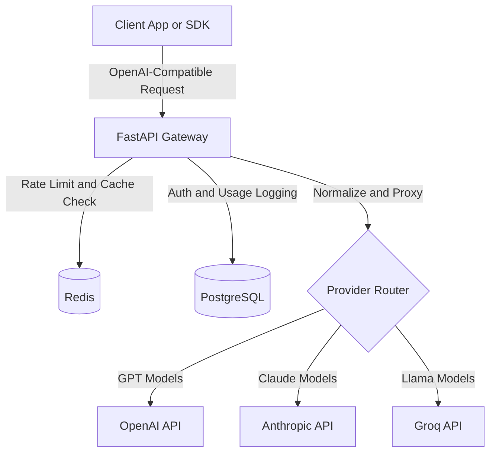

# LLM Inference Gateway

OpenAI-compatible LLM gateway with multi-provider routing, streaming normalization, Redis-backed rate limiting, fallback handling, caching, and usage analytics.

Built with **FastAPI**, **Redis**, and **PostgreSQL**.

---

## What This Is

This project is a lightweight inference gateway that normalizes multiple LLM provider APIs into the OpenAI chat completion schema. Clients can switch between OpenAI, Anthropic, and Groq models without changing application code.

### Features

- OpenAI-compatible `/v1/chat/completions` API
- Provider routing based on model prefixes
- Streaming response normalization across providers
- Redis-backed token bucket rate limiting
- Exact-match response caching
- Provider fallback on timeout or upstream failure
- PostgreSQL request logging and usage tracking

## Architecture



## Design Decisions

1. **Pydantic v2 schemas** are used as the canonical request and response contracts for provider normalization.
2. A shared async **httpx** client is initialized during FastAPI lifespan startup to reuse TCP connections under concurrency.
3. Responses are streamed directly using FastAPI `StreamingResponse` to minimize Time-to-First-Token latency.
4. Provider integrations implement a shared async interface so routing and fallback logic remain provider-agnostic.

## Quick Start

### 1. Setup

```bash
python3 -m venv .venv
source .venv/bin/activate
pip install -r requirements.txt
```

### 2. Start Infrastructure

```bash
docker compose up -d
```

### 3. Run the Gateway

```bash
OPENAI_API_KEY="sk-..." uvicorn app.main:app --reload
```

## Example Request

```bash
curl -X POST http://localhost:8000/v1/chat/completions \
  -H "Content-Type: application/json" \
  -d '{
    "model": "gpt-4o-mini",
    "messages": [
      {
        "role": "user",
        "content": "Explain async in Python in one sentence."
      }
    ],
    "stream": true
  }'
```

## Tradeoffs and Limitations

- Caching uses exact-match keys only; semantic similarity search is intentionally out of scope.
- Streaming is normalized to the OpenAI SSE schema, so some provider-specific metadata is omitted.
- Fallback prioritizes availability over deterministic output equivalence across models.
- Rate limiting is single-region Redis-backed and not designed for distributed coordination.
- Pricing uses static model cost tables and may drift from provider pricing updates.